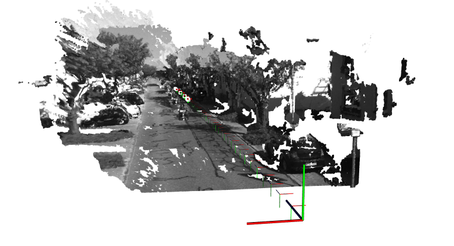

## Completed Features (Stereo Visual SLAM)

- [x] Load KITTI stereo dataset (image_0 and image_1 folders)
- [x] Extract stereo camera intrinsics and baseline
- [x] Compute disparity maps using StereoSGBM
- [x] Generate sparse depth map from disparity values
- [x] Extract keypoints and descriptors using SIFT
- [x] Perform FLANN-based matching and apply Lowe's ratio test
- [x] Triangulate 3D points using disparity map
- [x] Estimate pose (rotation and translation) between frames using solvePnPRansac
- [x] Accumulate global pose via transformation matrix
- [x] Convert camera poses to Eigen format for visualization
- [x] Generate point cloud from triangulated 3D points
- [x] Assign RGB color to each 3D point from image
- [x] Visualize poses and point cloud in PCLVisualizer
- [x] Implement **keyframe selection logic**
  - Based on:
    - Every N frames (e.g. 10)
    - Too few matches (< 100)
    - Large translation (> 1m)
    - Large rotation (> 0.5 degrees)

## In Progress

- [ ] Refactor code out of `main()` into classes/modules
- [ ] Add logging or overlay for pose and keyframe status
- [ ] Evaluate pose drift or errors (if ground truth available)

## Next Steps

- [ ] Add backend (bundle adjustment, loop closure)
- [ ] Optimize memory footprint (discard old data)
- [ ] Add persistent map saving/loading
